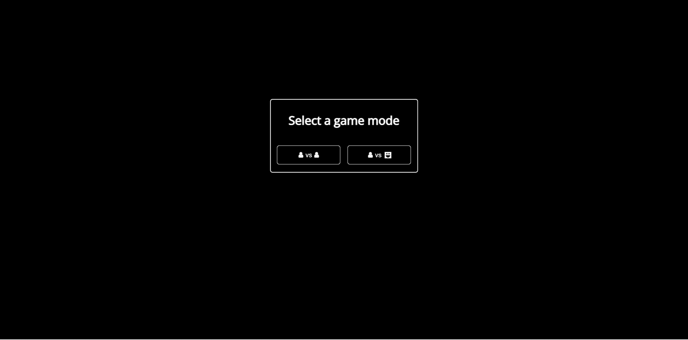
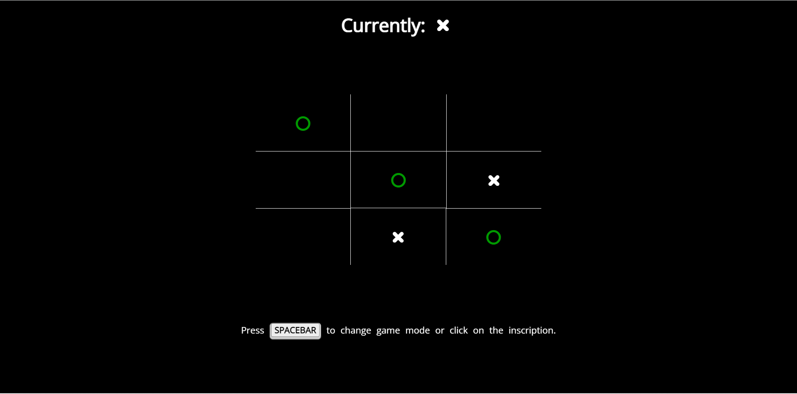
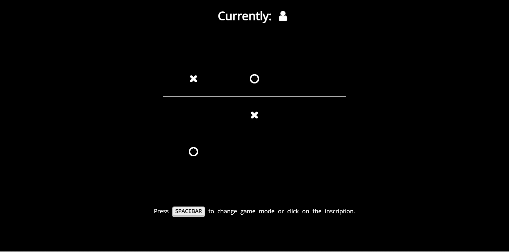
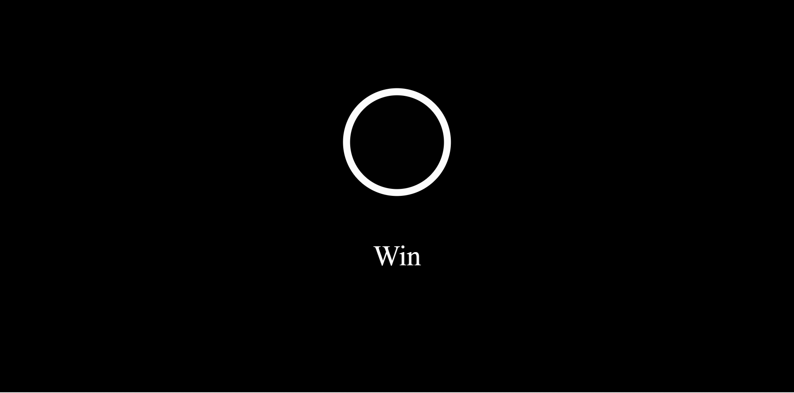
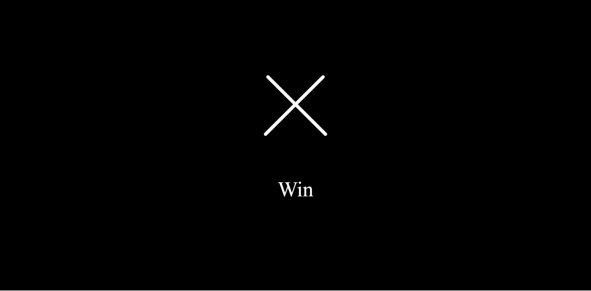
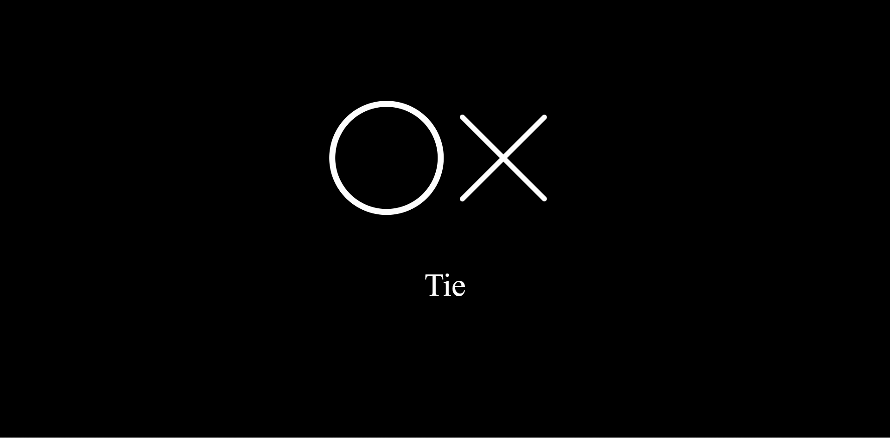

# tic-tac-toe

> Podgląd na żywo [_tutaj_](https://whimsical-churros-f32b36.netlify.app/).

## Spis treści

- [Cel](#Cel)
- [Ogólne informacje](#Ogólne-informacje)
- [Używane technologie](#Używane-technologie)
- [Stosowanie](#Stosowanie)
- [Jak tego użyć](#jak-tego-użyć)
- [Status projektu](#status-projektu)
- [Kontakt](#kontakt)
<!-- * [License](#license) -->

## Cel

- Projekt powstał by nauczyć się vue 3, pinia, typescript.

## Ogólne informacje

- Jest to standardowa gra w kółko i krzyżyk (bez użycia soketów, dla jednego urządzenia)
- Widzimy czyja jest obecnie kolej.
- Gra zaprezentuję zwycięstwo przez zmianę koloru znaku i wyświetlenie końcowej animacji z wynikiem.

## Używane technologie

- vue: ^3.0.0
- pinia: ^2.0.14,
- typescript: ~4.1.5
- gh-pages: ^4.0.0
- core-js: ^3.6.5

## Stosowanie

**Wybór trybu gry** To właśnie widzi osoba wchodząca na strone. Po wyborze rozpoczyna gre a okno znika. Można je spokojnie przywrócić naciskając spację lub klikając na tekst. .

<div style="margin-bottom: 60px; text-align: center">
  
</div>

**Wygrana** Jeśli padnie którakolwiek z zwycięskich kombinacji.

<div style="margin-bottom: 60px; text-align: center">
  
</div>

**Gra z botem** Bot szuka swoich okazji by nas pokonać.

<div style="margin-bottom: 60px; text-align: center">
  
</div>

**Końcowa animacja** Zależnie od wyniku zobaczymy odpowiednią animację.

<div style="margin-bottom: 60px; text-align: center">
  
  
  
</div>

<!-- If you have screenshots you'd like to share, include them here. -->

## Jak tego użyć

Aby sklonować i uruchomić tę aplikację, potrzebujesz [Git](https://git-scm.com) i [Node.js](https://nodejs.org/en/download/) (który jest dostarczany z [ npm](http://npmjs.com)) zainstalowany na Twoim komputerze. Z wiersza poleceń:

```bash
# Klonowanie repozytorium
$ git clone https://github.com/Maty2002v2/-Tic-Tac-Toe.git

#Wejdź do folderu repozytorium
$ cd -Tic-Tac-Toe

#Wejdź do folderu aplikacji
$ cd tic-tac-toe

# Zainstaluj zależności
$ npm install

# Uruchom aplikację
$ npm run serve
```

## Status projektu

Project is: _in progress_

## Kontakt

Stworzone przez [@Maty](mailto:mateusz_malolepszy_02@wp.pl) - nie wahaj się ze mną skontaktować!

<!-- Optional -->
<!-- ## License -->
<!-- This project is open source and available under the [... License](). -->

<!-- You don't have to include all sections - just the one's relevant to your project -->
